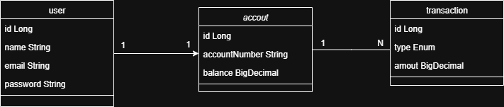

# Digital Wallet

# 📋 Descrição do Projeto
Esta API RESTful foi desenvolvida para gerenciar o funcionamento de uma conta digital, oferecendo recursos para criação de conta, saque, depósito e tranferência.
Com ela, é possível:

## Detalhes de Implementação

- ``Todas as operações críticas (ex.: transferência de saldo) utilizam **transações** para garantir consistência.``

- ``**DTOs** são usados para separar a camada de domínio das requisições e respostas da API.``

- ``**Validação de dados** é feita via Bean Validation.``

- ``**Tratamento global de exceções** centraliza respostas de erro.``

- ``**Segurança**: autenticação e autorização via JWT.``

- ``**Paginação e ordenação** são suportadas usando Spring Data JPA Pageable.``

A aplicação foi construída com Java, Spring Boot, JPA/Hibernate e segue boas práticas de desenvolvimento como separação por camadas, uso de DTOs e tratamento centralizado de exceções.

## Diagrama de Classes (Domínio da API)

## ✔️ Técnicas e tecnologias utilizadas

- ``Java 17``
- ``InteliJ IDEA``
- ``Paradigma de orientação a objetos``
- ``Spring Boot``
- ``Spring Data JPA``
- ``Hibernate``
- ``RESTful APIs``
- ``PostgreSQL``
- ``Maven``
- ``DTO (Data Transfer Objects)``
- ``Swagger``
- ``Insomnia``

## ✔️ Funcionalidades Principais

- ``Autenticação e autorização com JWT``
- ``CRUD de entidades ()``
- ``Tratamento de exceções``
- ``Validação de dados``
- ``Paginação e ordenação de resultados``

